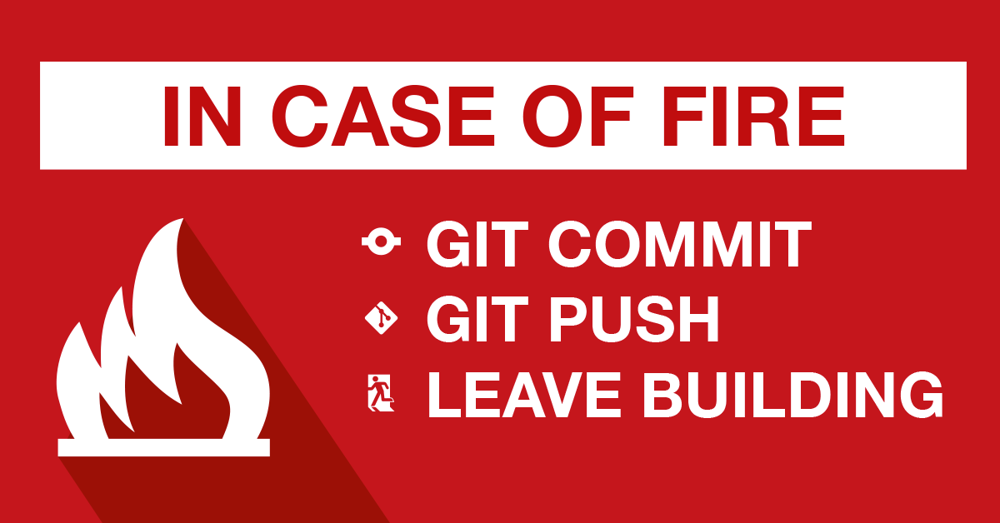

# SHD-git
A git workshop being held at Science Hack Day in Ljubljana on Nov 25 2017.

## What is git?

Git is code versioning standard. There are many git hosting services available:
GitHub, GitLab, BitBucket, Visual Studio Team Services,...

With git you can have your code safely on a remote server, ready to be accessed
by whomever you grant access. With the proper use of git all previous versions
of your documents are saved and available.

On Linux, chances are that git command line interface is already installed. On
Windows and Mac computers I recommend you [download git tools](https://git-
scm.com/downloads). You can open a bash terminal with right click in your
preffered folder and clicking `Git Bash Here`.

## Create a GitHub account and a repository

We will be working with GitHub as the most standard for open source projects. If
you don't have one yet navigate to [https://github.com](https://github.com) and
create an account with them.

With a plus sign in the top right you can create a new repository that will hold
your prject. It is recommended that you include a `README.md` file in your
repository (like this one) that gives a description of your project.

You can write the `README` file using the [Markdown descriptive language](https://github.com/adam-p/markdown-here/wiki/Markdown-Cheatsheet).

## Basic git commands

When first creating a local copy of a git repository you can use the `git clone`
command. The actual url will depend on your username and repository, but for
this repository this command yould look like this:

```
git clone git@github.com:MKolman/SHD-git.git
```

Once you have a local copy you will never have to call `git clone` for this
repository again.

You have at your disposal the following basic commands:
 - `git pull` pull new changes from the remote server to your local copy,
 - `git push` push changes from your local copy to the remote server,
 - `git add <filename>` add all changes in `<filename>` to __staging__,
 - `git reset <filename>` reverse `git add`,
 - `git commit -m <message>` commit all changes that are in __staging__,
 - `git checkout <commit>` revert all files to what they were after commit `<commit>`,
 - `git status` view the current state of your local copy,
 - `git log` view the history of commits in this repository,
 - `git diff` show all unstaged changes in your local copy.


### What a typical workflow might look like
```bash
$ git status  # Make sure I have no local changes
On branch master
Your branch is up to date with 'origin/master'.

nothing to commit, working tree clean

$ git pull  # Get new changes from remote server
Already up to date.
```
```bash
$ touch new_file.txt  # Create a new file
$ git status
On branch master
Your branch is up to date with 'origin/master'.

Untracked files:
  (use "git add <file>..." to include in what will be committed)

    new_file.txt

nothing added to commit but untracked files present (use "git add" to track)
```
```bash
$ git add new_file.txt  # Add new file to staging
$ git status
On branch master
Your branch is up to date with 'origin/master'.

Changes to be committed:
  (use "git reset HEAD <file>..." to unstage)

    new file:   new_file.txt
```
```bash
$ git commit -m "Create new file"  # Commit the changes
[master 6b1ff71] Create new file
 1 file changed, 0 insertions(+), 0 deletions(-)
 create mode 100644 new_file.txt
$ git status
On branch master
Your branch is ahead of 'origin/master' by 1 commit.
  (use "git push" to publish your local commits)

nothing to commit, working tree clean
```
```bash
$ git push  # Push the new file into the remote repository
Counting objects: 3, done.
Delta compression using up to 8 threads.
Compressing objects: 100% (2/2), done.
Writing objects: 100% (3/3), 315 bytes | 315.00 KiB/s, done.
Total 3 (delta 0), reused 0 (delta 0)
To github.com:MKolman/SHD-git.git
   817f344..6b1ff71  master -> master
```

## Branches

Sometimes you want to create a new branch of commits. Maybe to create a new
feature or to fix a bug without disturbing the `master` branch, which is the
default branch name.


You can create a new branch with the command

```bash
git branch <branch-name>
```

You can switch between branches with the command

```bash
git checkout <branch-name>
```

### Joining new branches back into the master branch

Once you complete a feature or resolve a bug you might wish to port the changes
back to the `master` branch.

There are two ways of joining branches
 - `git merge <branch-name>` merges `<branch-name>` into the current branch and
    creates a so-called merge commit where it commits the different changes from
    both branches.
 - `git rebase <branch-name>` applies the changes from `<branch-name>` and then
    re-applies the changes of the current branch on top.


## Jokes

